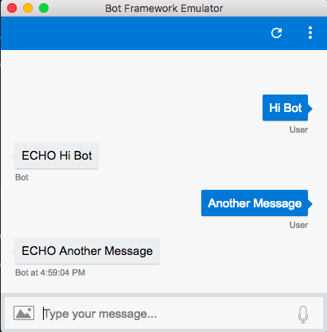

# AZURE BASIC ECHO BOT 
> A simple basic azure bot written in Node.Js.



## Installation

OS X & Linux:

```sh
npm install 
```

## Development setup

1. Create bot using Bot Services on azure portal. 
2. Rename the '.env.template' to '.env'.
3. Copy the Ms-App-Id and the Ms-App-Pwd for the bot from the portal.
4. Run the following commands.
```sh
npm install
node app.js
```
5. Run the following command to set up your endpoint URL.
```sh
ngrok http 3978
```
6. Start the bot-emulator using the ngrok endpoint url and use the same Ms-App-Id and the Ms-App-Pwd.


## license
MIT

## Reference 
This MD  was made using template from https://github.com/dbader/readme-template/blob/master/README.md

